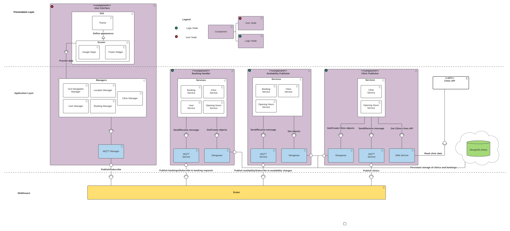
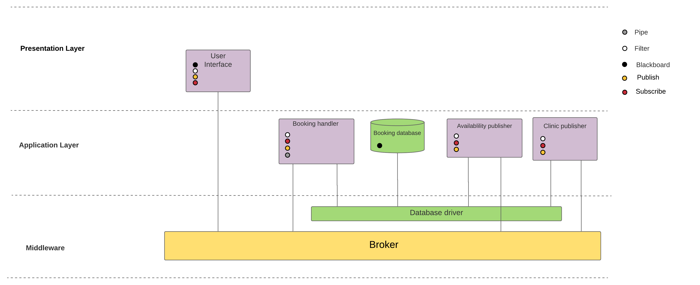
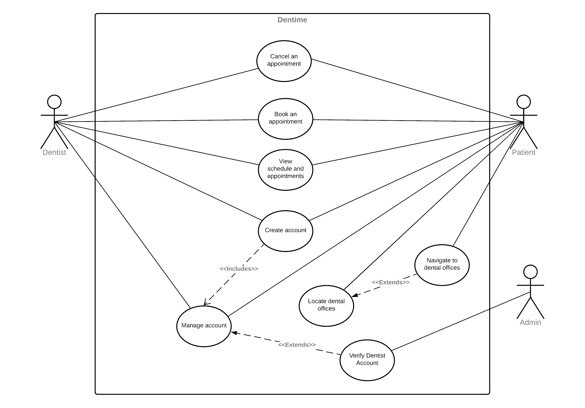
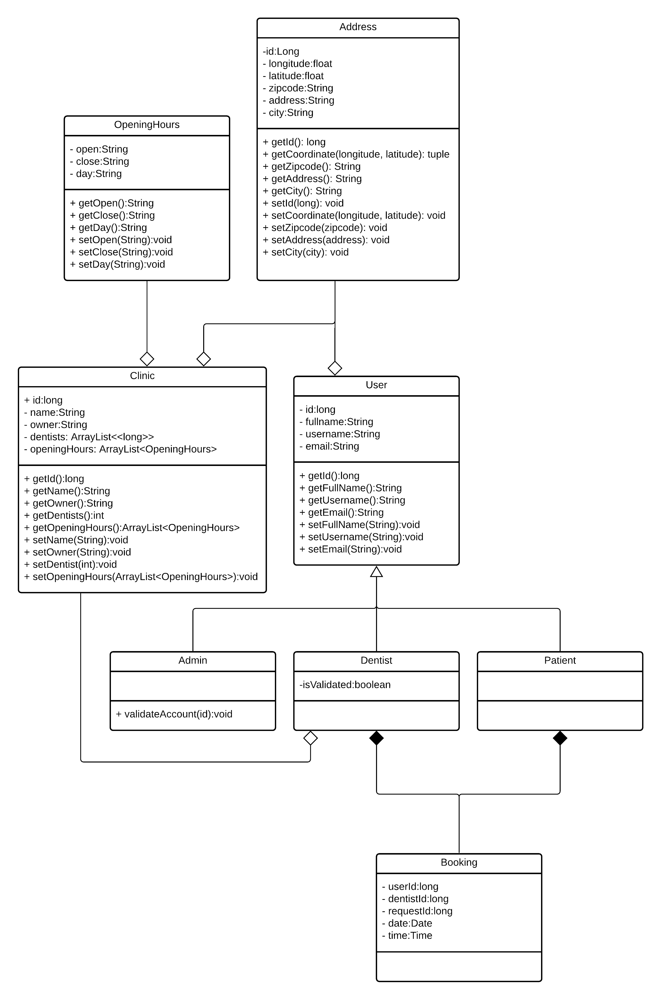
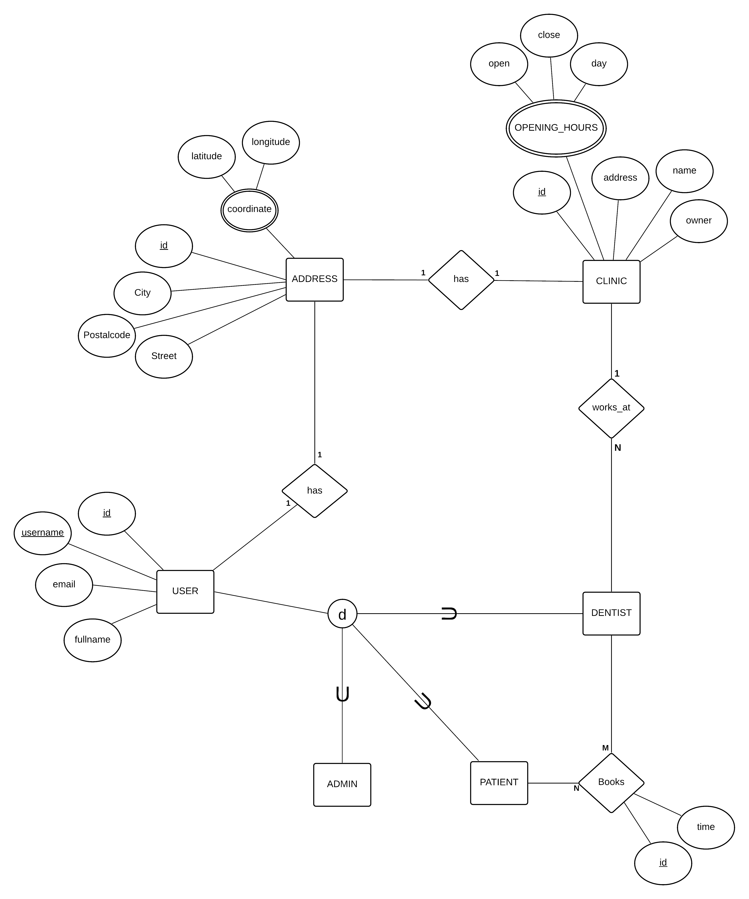

Repository for a group project incorporating a distributed systems architecture with MQTT

# Dentime - Group Project

# Purpose

## Task
The purpose of this project is to create an application for booking dentist appointments. This service is designed specifically for citizens of Gothenburg in Sweden.
Through a graphical user interface, a user shall be able to find available times in
user-specified time-windows. Our solution will be based on a distributed system that
combines various architectural styles. We will keep track of the availability of free time-spots
for a number of fictive dentists which will be graphically displayed
to the user. A user is able to book appointments and receives a confirmation/rejection
through the system.
## Team Members
- [Altug Altetmek](https://git.chalmers.se/altug)
- [Arvin Esfahani](https://git.chalmers.se/sakhi)
- [Dia Istanbuly](https://git.chalmers.se/diai)
- [Filip Lewenhagen](https://git.chalmers.se/filiple)
- [Leith Hobson](https://git.chalmers.se/leith)
- [Mohammadali Esfahani](https://git.chalmers.se/mohesf)
- [Max Zimmer](https://git.chalmers.se/maxfri)
## Links to All Relevant Related Team Resources
- [Trello Board](https://trello.com/b/UJFezz4T)
- [Documentation Repository](https://git.chalmers.se/courses/dit355/2020/group-10/documentation)
- [Frontend Repository](https://git.chalmers.se/courses/dit355/2020/group-10/frontend)
- [Backend Repository](https://git.chalmers.se/courses/dit355/2020/group-10/backend)
- [Request Generator](https://git.chalmers.se/courses/dit355/2020/group-10/requestgenerator)
## Used Technologies
- [Flutter SDK](https://flutter.dev/docs/get-started/install)
- [Android Studio](https://developer.android.com/studio)
- [Visual Studio Code](https://code.visualstudio.com/)
- [Eclipse Mosquitto](https://mosquitto.org/)
- [Dart](https://dart.dev/)
- [Node.js](https://nodejs.org/en/)
- [Node Package Manager (npm)](https://www.npmjs.com/)
- [Mongoose](https://mongoosejs.com/)
- [Node Version Manager (nvm)](https://github.com/nvm-sh/nvm)

# Diagrams:
### Component Diagram:

**Component Diagram description:**

**User Interface:**

User Interface: The graphical interface that interacts with the user. The Theme holds all the graphical information used to shape the GUI.

**Availability Publisher**

The Availability Publisher node is responsible for publishing the available booking times in the different clinics where users can book them using the User node.

**Booking Handler**

The Booking Handler node is responsible for handling all booking requests from the User node including creating and deleting bookings and finding the first available time.

**Clinic Publisher**

The Clinic Publisher node is responsible for publishing the list of clinics to the MQTT broker so other nodes will be able to access them.

### Style Diagram

**Style Diagram description**

This diagram shows our architectural style and the relationship between our components.

### Sequence Diagrams:
Note: It is assumed that the backend, and frontend have both already subscribed to the relevant topics with the MQTT broker, when they loaded.

**Sequence Diagram description:**

It demonstrates the order of actions taken by the user and different system components based on different scenarios including making a booking and whether it’s successful or not.

### Use Case diagram:

### Backend Class Diagram:

### EER Diagram:

# Software Architecture Document (SAD)

The following architectural styles have been chosen as a basis of our distributed software development:
- Publish/Subscribe
- Pipe and filter
- Blackboard

## Why did we pick it, and how does it apply to our application?
### Publish/Subscribe:
This is the general way of communication between the components of our project. Throughout our project, we are using MQTT, which enforces publish/subscriber style. Via the MQTT broker, the components are subscribed to the stream of messages. When a message is published, all the components that are subscribed to the publisher get the message. We use this style mostly because we want a distributed system in general for the project. There are pros and cons with a distributed system. The unknown source of broken code, and the components being unaware of each other are examples to cons. The final product being more available while protecting its UI structure can be counted as a pro of distributed systems. At the end, since we want a distributed system, we are using publish/subscribe with MQTT.

### Pipe and filter:
Through the Publish/Subscribe style, our ‘frontend’ will receive a data stream from the backend, via the MQTT broker. At any point, data could arrive on this stream, and this data could potentially require that the active UI is updated. The pipe and filter style will enable this incoming data to be filtered, such that the relevant changes can be made to the on screen UI elements. When parsing JSON objects, both in the front- and back-end we will be implementing the pipe and filter architecture style. Furthermore, the MQTT broker in fact utilises the pipe and filter style in order to con/diverge published messages to the relevant subscribers.

### Blackboard:
Has an asynchronous interaction style and has processing units as components. The concept of Blackboard architecture is a concurrent transformation on shared data. The components in this architecture are not connected to each other but one or many of them might be connected to the same dataspace. This architecture has two types of behaviors: a passive repository, which is accessed by a set of components similar to databases and servers, and an active repository in which it sends notifications to components when the data changes similar to an active database. Since we will be working in teams on different tasks then we will be able to take full advantage of the team problem-solving approaches which is one of the key advantages of the blackboard architecture. Furthermore, this architecture is well known for its robustness quality factor in which it allows all components to be replicated. It has also a high flexibility quality where the functionality of the components can be changed easily. In case we need to add more functionalities to our application, this architecture style is well known for its Extensibility quality factors where we can add new components  if needed. 

# Program Management Report (PMR)

We are integrating the Agile (Scrum) software process, along with a kanban-like practice with Trello (see the link on purpose). We are having weekly meetings every Wednesday where we look at our Trello board, have a sprint report of the previous week, move the cards to done if any. Later, we have a sprint retrospective where we discuss about what went wrong and okay on the sprint. We argue what should be carried out onto the next sprint, and what the next sprint should look/consist of. We finish the report/retrospective part after dealing with all the cards of the relevant sprint on Trello by dragging them to appropriate columns, and making the prioritization (backlog management). When this is done, we plan the next sprint by creating new cards from the user sotires and requirements we have listed on our Trello, and decide which ones we should aim to implement for the coming week's sprint.

With also all of this, we adopt an incremental delivery practice where we integrate it with our Scrum practices. We define increments during the sprint plannings, and evaluate them on the retrospective and report.

User story practice comes along with the above stated, since our motivation on implementing any given functionality comes from the suer stories. Please see the process diagram below.

### Milestone Report

2020-11-30:
The team held a meeting to address schedule, roles and tasks more clearly. The team settled on a hierarchy in how tasks should be prioritized to acommodate the upcoming deadlines. Tasks were distributed to the team members and any doubts related to roles were cleared up.
For more information check the official Trello-board.

2020-12-09:
The team held a meeting to address major management, communication and commitment issues. Results of the meeting included to adopt a proper SCRUM process for the rest of the project runtime, raise effectivity while working and more. Decision to hold a follow-up meeting with a 100% participation rate was made. This meeting would be held within 36 hours.

2020-12-10:
The team held a meeting were they started inplementing the new SCRUM structure. All team members were present. In this meeting the team decided on new regular weekly meetings on Monday and Thursday at 11:00 (application and progress briefing) and Wednesdays at 13:30 (2020-12-16) and 15:00 (2020-12-23 onwards) (Sprint review and retrospective). The team also started re-structuring the project Trello-page and finished the sprint review and retrospective for week 5 (past week).

2020-12-14:
The team held a meeting with the intent of briefing and working on highly prioritized tasks. The team managed a complete briefing of the frontend, tweaked the component diagram, and added short descriptions to the diagrams.

2020-12-28:
The team held a meeting to take care of all remaining issues. These included documentation changes, application features and more.

2020-01-04:
The team held a meeting to wrap up the process. Any last bugfixes and features that had yet to be implemented were scheduled.

# Software Requirement Specification (SRS)

## Functional Requirements (FR)

<table>
    <thead>
        <tr>
            <th>ID</th>
            <th>Requirement Description - FR</th>
            <th>User Story(s)</th>
        </tr>
    </thead>
    <tbody>
        <tr>
            <td>FR1</td>
            <td>Patients should be able to locate all dentists in their vicinity.</td>
            <td>
                <ul>
                    <li>
                        As a patient who requires dental care, I want to locate my closest dentist, so that I don't have to travel uneccessarily.
                    </li>
                    <li>
                    As a new resident in the city, I want to discover the closest dental clinics around my area, so that I can keep track of my dental care.
                    </li>
                </ul>
            </td>
        </tr>
        <tr>
            <td>FR2</td>
            <td>Patients should be able to book an appointment at the desired dental office.</td>
            <td>
                <ul>
                    <li>
                        As a patient, I want to book an apointment with a certain dental clinic, so that I can have a guaranteed time slot.
                    </li>
                </ul>
            </td>
        </tr>
        <tr>
            <td>FR3</td>
            <td>Patients should be able to cancel their own appointments.</td>
            <td>
                <ul>
                    <li>
                        As a patient who is not available for my scheduled appointment, I want to	cancel my scheduled booking, so that I do not have to pay a fee, if I am unable to arrive.
                    </li>
                </ul>
            </td>
        </tr>
        <tr>
            <td>FR4</td>
            <td>Dentists should be able to update their dentristy information.</td>
            <td>
                <ul>
                    <li>
                        As a dentist who has chanegd their dentist info, I want to be able to update my dentistry information so that the patients won't be misinformed.
                    </li>
                </ul>
            </td>
        </tr>
        <tr>
            <td>FR5</td>
            <td>Patients should be able to get directions to their appointment through Google Maps.</td>
            <td>
                <ul>
                    <li>
                        As a patient who has upcoming appointments, I want to get suitable routes to the clinic when walking, driving or taking the train, so that I can navigate easily to my apointment.
                    </li>
                </ul>
            </td>
        </tr>
        <tr>
            <td>FR6</td>
            <td>The system should allow the patients to book an appointmnet according to their selected time slot.</td>
            <td>
                <ul>
                    <li>
                        As a patient who wants to book a time slot, I want to be bale to pick an available time slot, so that i can schose the most suitable timeframe.
                    </li>
                </ul>
            </td>
        </tr>
        <tr>
            <td>FR7</td>
            <td>Patients should be able to view their upcoming and past appointments.</td>
            <td>
                <ul>
                    <li>
                        As a patient who has upcoming appointments, I want to view my upcoming appointments, so that I can keep track of my upcoming booking,
                    </li>
                    <li>
                        As a patient who has had previous appointments, I want to	view my past appointments, so that I can keep track of my dental helth progress.
                    </li>
                </ul>
            </td>
        </tr>
        <tr>
            <td>FR8</td>
            <td>Patients shall be able to see a list of dentists with their key information.</td>
            <td>
                <ul>
                    <li>
                        As a patient who wants to view available dentists, I want to see a list of dentists with their key information, so that I can have a full view of dentists.
                    </li>
                </ul>
            </td>
        </tr>
        <tr>
            <td>FR9</td>
            <td>The system should display a vidual clue on the map about the availability of dentists in a given time/date.</td>
            <td>
                <ul>
                    <li>
                        As a patient in hurry, I want to be able to get visual clues on the availability o dentists a given time/date, so that I can quickly decide which dentist to book from
                    </li>
                </ul>
            </td>
        </tr>
    </tbody>
</table>

## Non-Functional Requirements (NFR)

<table>
    <thead>
        <tr>
            <th>ID</th>
            <th>Requirement Description - NFR</th>
            <th>User Story(s)</th>
        </tr>
    </thead>
    <tbody>
        <tr>
            <td>NFR1</td>
            <td>Patients shall be able to book an appointment in one minute.</td>
            <td>
                <ul>
                    <li>
                        As a patient who is booking an appointment, I want the application to allow me to make a new booking within one minute, so that I do not have to waste time.
                    </li>
                </ul>
            </td>
        </tr>
        <tr>
            <td>NFR2</td>
            <td>The application shall load within 5 seconds.</td>
            <td>
                <ul>
                    <li>
                        As a user who is in a hurry, I want to make sure that i can load the app in a short time, so that I dont waste time waiting
                    </li>
                </ul>
            </td>
        </tr>
        <tr>
            <td>NFR3</td>
            <td>The application shall crash less than once on average per booking.</td>
            <td>
                <ul>
                    <li>
                        As a user of the application, I want the application to crash on average less than once per booking, so that I do not experience frustration.
                    </li>
                </ul>
            </td>
        </tr>
        <tr>
            <td>NFR4</td>
            <td>The maps shall load in less than 6 seconds.</td>
            <td>
                <ul>
                    <li>
                        As a user who in a hurry, I want to make sure that i can load the maps in a short time, so that I dont waste time waiting.
                    </li>
                </ul>
            </td>
        </tr>
        <tr>
            <td>NFR5</td>
            <td>Patients who use the list view can see the dentist offices in order by their distance.</td>
            <td>
                <ul>
                    <li>
                        As a patient who wants ordered view, I want to see the list of available dentists from closest to farthest to me, so that I dont have to go back and forth in the map and waste time.
                    </li>
                </ul>
            </td>
        </tr>
        <tr>
            <td>NFR6</td>
            <td>The app should handle over 100 booking requests without crashing</td>
            <td>
                <ul>
                    <li>
                        As a user who is using the application, I want to be able to use the app without having to worry about crashes from booking loads, so that I can have a nice experience with the app.
                    </li>
                </ul>
            </td>
        </tr>
    </tbody>
</table>

## Constraints

<table>
    <thead>
        <tr>
            <th>ID</th>
            <th>Requirement Description - Constraint</th>
            <th>User Story(s)</th>
        </tr>
    </thead>
    <tbody>
        <tr>
            <td>C1</td>
            <td>User data should only be available to the registered user, and, on the day of their appointment, to their dentist.</td>
            <td>
                <ul>
                    <li>
                        As a user who wants to use the app with confidentiality, I want to have my personal information hidden from others, so that I can keep my anonimity.
                    </li>
                </ul>
            </td>
        </tr>
        <tr>
            <td>C2</td>
            <td>The app should follow GDPR guidelines.</td>
            <td>
                <ul>
                    <li>
                        As a user who wants to use the app with confidentiality, I want to have my personal information hidden from others, so that I can keep my anonimity.
                    </li>
                </ul>
            </td>
        </tr>
    </tbody>
</table>

